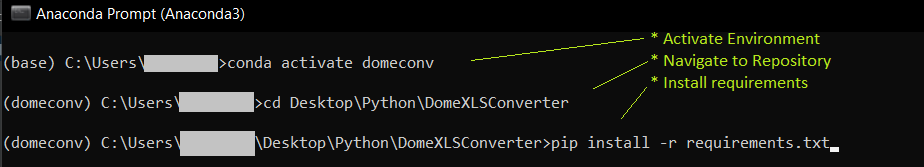

# EXCEL to ICES Dome Conversion Tool

## Installation
If no Python version is yet installed, please install miniconda, following the instructions here:
https://docs.conda.io/en/latest/miniconda.html

Clone this repository in any local directory.

Next, create and setup a new environment, using the *Anconda Prompt* App (Just search for it in the Windows Start Menu):
* In the command prompt run:
````python 
conda install --name=domeconverter python=3.9
````
* Activate the environment with: _conda activate domeconverter_
* navigate into the DomeXLSConverter folder
* run: 
````python 
pip install -r requirements.txt
````



This installs all required python packages.

## Launch the tool
In the _Anaconda Prompt_ run (having activated the domeconverter environment) run the command:
_python main.py_

Then follow the instructions in the user ui.

## Code Structure
