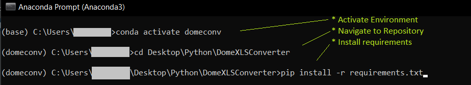
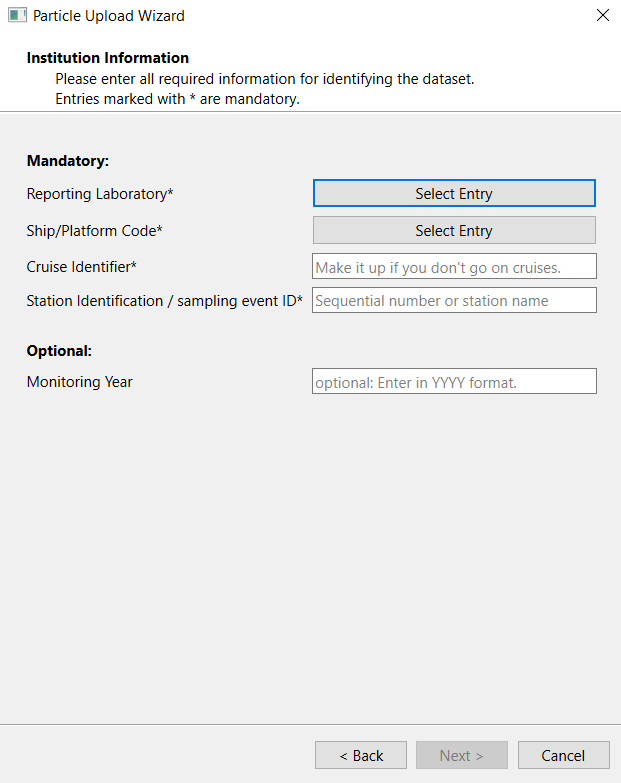
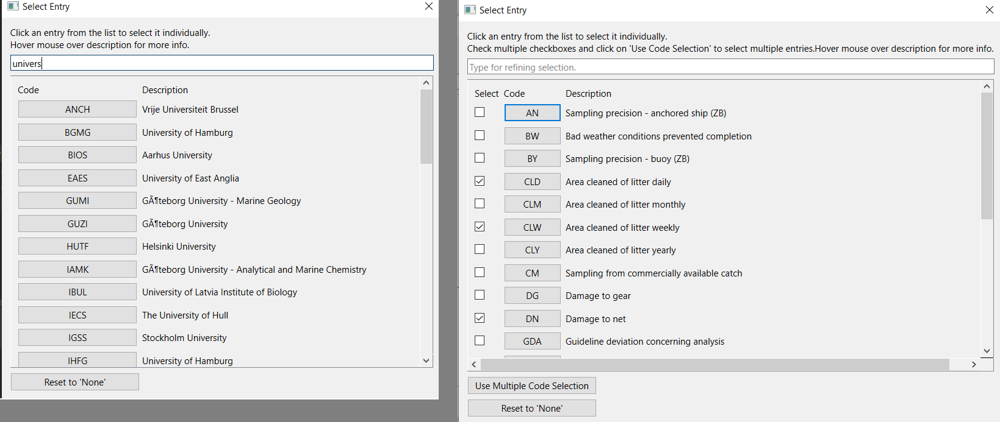

# EXCEL to ICES Dome Conversion Tool

## Purpose of the tool
The converter aims to facilitate converting arbitrary particle datasets strored in excel sheets
into the ICES Simplified Litter Format. A detailed description and example data can be downloaded here:
https://www.ices.dk/data/Documents/ENV/Environment_Formats.zip

The conversion tool can read in an excel file (if multiple sheets are present, only one can be processed at the moment)
and will prompt the user for the required meta-data. Additionally, the user is asked to
assign specific columns to be used for *per-particle* data, such as particle size or color.
<br>With all that the conversion tool produces a .csv file that can be uploaded to the ICES DOME Database.
<br>Therefore, upload the output file here to convert it to the final DOME litter format:
https://vocab.ices.dk/DataConversion


## Installation
If no Python version is yet installed, please install miniconda, following the instructions here:
https://docs.conda.io/en/latest/miniconda.html

Clone this repository in any local directory.

Next, create and setup a new environment, using the *Anconda Prompt* App (Just search for it in the Windows Start Menu):
* In the command prompt run:
````
conda install --name=domeconverter python=3.9
````
* Activate the environment with: 
````
conda activate domeconverter
````
* navigate into the DomeXLSConverter folder
* run: 
```` 
pip install -r requirements.txt
````

The following screenshot shows the procedure (note, that the environment in my case was just named *domeconv*).


This installs all required python packages.


## Launch and use the tool
In the _Anaconda Prompt_ run (having activated the domeconverter environment) run the command:
````python
python main.py
````

Then follow the instructions in the user ui.
<br>There is an exampledata.xlsx file in the */data* directory that can be used for testing.

The conversion wizard guides the user through a number of pages to prompt for meta-data to be stored
with the particle data. The pages look like that:

In most cases there are mandatory and optional data fields. Some require "free text" entries, other require
to select specific codes from pre-defined lists. Such cases are indicated with *"Select Entry"* Buttons.
<br> Click them to open a dialog window. It allows to filter for entries by typing in the line on the top of the 
window (left image). In some cases, multiple selections are possible as well, as indicated by checkboxes in front
of each entry. Select as desired and click on *"Use Multiple Code Selection"* (right image)


The wizard checks if all required fields are set correctly. Only then the *"Next"* button on the end of each page
is activated.


## Code Structure
to be continued..